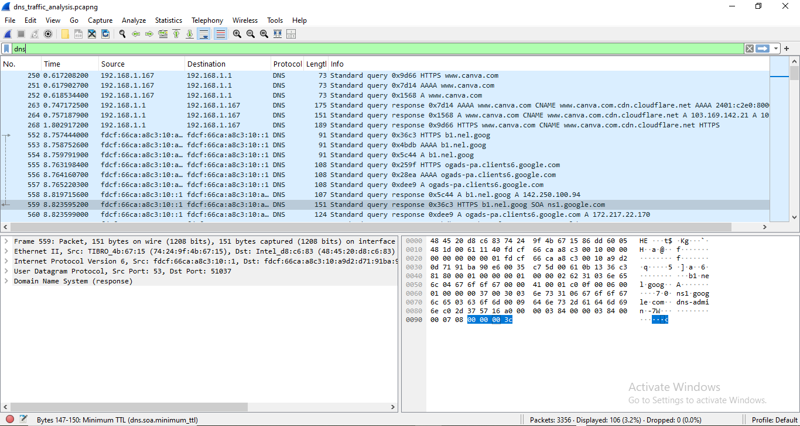
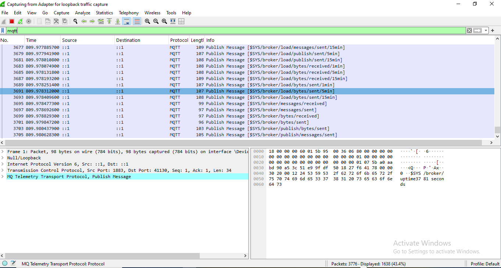

# Network-Security
# Network Security & Packet Analysis

This directory contains hands-on labs focused on active network reconnaissance,protocol analysis, and detecting security anomalities in IoT and standard network environment.

---

Project Title: WSL Network Reconnaissance Environment
Objective:

To establish a native Nmap environment within Windows Subsystem for Linux (WSL) and perform multi-stage network reconnaissance on a target system.

Methodology:

Environment Setup: Configured WSL to interface with native Nmap binaries, troubleshooting socket binding errors (errno 92) by implementing TCP Connect Scans (-sT).

Reconnaissance Progression:

Stage 1 (Host Discovery): Verified host status using basic TCP connection.

Stage 2 (Version Detection): Utilized -sV to identify specific service software and versions (e.g., OpenSSH 6.6.1p1, Apache 2.4.7).

Stage 3 (Vulnerability & Metadata): Employed Nmap Scripting Engine (-sC) to extract host keys and service headers.

Workflow Optimization: Created custom shell aliases in .bashrc to standardize scan procedures and reduce command execution overhead.

Key Learnings:

Troubleshooting: Learned to handle raw socket permission issues in virtualized environments by switching to TCP Connect scans.

Redirection: Mastered standard error redirection (2>/dev/null) to maintain clean, readable terminal output for reporting.

Tool Mastery: Shifted from basic port scanning to service identification and configuration fingerprinting.


# Local Security Sandbox: WSL2 Network Reconnaissance & Workflow Optimization

An engineering log documenting the setup, optimization, and execution of a local network security testing sandbox. This project demonstrates the ability to configure terminal environments, troubleshoot virtualization layer networking constraints, and perform structured reconnaissance on target systems.

---

##  Project Overview & Engineering Decisions

When building a security lab on a local machine with virtualization restrictions, leveraging **Windows Subsystem for Linux (WSL)** is a highly efficient alternative. However, running security tools across a translation layer introduces unique networking challenges. 

This project documents the step-by-step engineering decisions made to bypass these restrictions, optimize command-line execution, and execute a structured, multi-stage reconnaissance workflow.

### Key Technical Achievements:
* **WSL Network Troubleshooting:** Diagnosed and resolved raw socket interface binding limitations (`errno: 92 Protocol not available`) by pivoting from SYN Stealth Scans to standard TCP Connect Scans (`-sT`).
* **Environment Optimization:** Developed custom shell aliases in `.bashrc` to standardize scan profiles and streamline the penetration testing workflow.
* **Output Hygiene:** Implemented standard error redirection (`2>/dev/null`) to suppress OS-level virtualization warnings, ensuring clean, machine-parseable scan outputs.

---

##  The Reconnaissance Workflow (Phase 1 to Phase 3)

Rather than executing random commands, a structured, methodology-driven approach was utilized to gather intelligence on the target host (`scanme.nmap.org`).

### Phase 1: Host Discovery & Port Scanning
* **Objective:** Identify active services on the target machine without generating unnecessary network noise.
* **Command:** `nmap -sT scanme.nmap.org`
* **Result:** Discovered 4 active TCP ports: `22 (SSH)`, `80 (HTTP)`, `9929 (nping-echo)`, and `31337 (Elite)`.

### Phase 2: Active Service & Version Fingerprinting
* **Objective:** Identify the exact software and version numbers running on the discovered ports to map out the potential attack surface.
* **Command:** `nmap -sT -sV -p 22,80,9929,31337 scanme.nmap.org`
* **Result:** 
  * Port 22 identified as running **OpenSSH 6.6.1p1 (Ubuntu)**.
  * Port 80 identified as running **Apache httpd 2.4.7 (Ubuntu)**.
  * *Analytical Note:* Based on the software release cycles, this combination indicates the target is likely running an unpatched legacy OS (Ubuntu 14.04 LTS), presenting a high probability of known vulnerability exposure.

### Phase 3: Vulnerability & Cryptographic Metadata Extraction
* **Objective:** Extract server-side configurations, such as SSH cryptographic host keys and HTTP web application titles, using the Nmap Scripting Engine (NSE).
* **Command:** `nmap -sT -sC -p 22,80 scanme.nmap.org`
* **Result:** Successfully extracted active host key fingerprints (`RSA`, `ECDSA`, `ED25519`) and verified the web server's application title.

---

##  Automation & Workflow Optimization

To prevent command fatigue and ensure consistent execution across future security assessments, the following custom aliases were engineered into the local shell configuration (`~/.bashrc`):

```bash
# Optimized Nmap Profiles for WSL Sandbox
alias nmap-basic='/usr/bin/nmap -sT scanme.nmap.org 2>/dev/null'
alias nmap-version='/usr/bin/nmap -sT -sV -p 22,80,9929,31337 scanme.nmap.org 2>/dev/null'
alias nmap-scripts='/usr/bin/nmap -sT -sC -p 22,80 scanme.nmap.org 2>/dev/null'


---


Module 2: DNS Traffic Analysis & Protocol Investigation
Objective
To analyze DNS (Domain Name System) traffic using packet capture files (.pcapng) to establish a baseline of normal domain resolution behavior and identify potential anomalous patterns, such as DNS tunneling, unauthorized zone transfers, or command-and-control (C2) beaconing.

Methodology & Toolset
Analysis Tool: Wireshark / tshark

Core Protocol: DNS (UDP Port 53)

Primary Wireshark Filters Used:

dns (Broad protocol filter)

dns.flags.response == 0 (Isolate queries only)

dns.flags.response == 1 (Isolate responses only)

dns.qry.type == 252 (Detect AXFR zone transfer attempts)

Packet-Level Analysis & Key Findings
Transaction Tracking: Analyzed the relationship between standard queries and responses by matching 16-bit Transaction IDs across UDP packets. Verified that responses matched the initial query parameters to rule out DNS cache poisoning attempts.

Payload Inspection: Inspected the query strings (QNAME) within the DNS Question section. Verified query volumes and domain name structures to ensure no high-entropy, long subdomain strings (which typically indicate data exfiltration via DNS tunneling or active C2 channels).

DNS Record Distribution: Classified resolved records by type (A, AAAA, CNAME, MX, TXT). Particular attention was paid to TXT records, which are commonly abused by threat actors to payload-delivery mechanisms.

Analytical Conclusion & Security Recommendations
Enforce DNS Security Extensions (DNSSEC): Implement DNSSEC to cryptographically sign DNS data, ensuring origin authenticity and data integrity to mitigate DNS spoofing/man-in-the-middle attacks.

Deploy Response Policy Zones (RPZ): Integrate DNS firewalls utilizing RPZ to actively block outbound queries to known malicious domains, effectively breaking the C2 loop at the reconnaissance phase.

## Lab 1: DNS Protocol Verification over Local Wireless Gateway
**Objective:** Capture and analyze real-time Domain Name System (DNS) request and response handshakes over a local production gateway.

### Visual Evidence


### Protocol Analysis Summary
During this exercise, the local host client machine (`192.168.1.117`) initiated an outbound web communication string, requiring a domain name resolution query for `www.canva.com`. 

* **Raw Network Capture Log:** [Download Packet Capture (.pcapng)](./dns_traffic_analysis.pcapng)


---


Module 3: IoT Protocol Analysis & MQTT Cleartext Leak Mitigation
Objective
To intercept, dissect, and analyze machine-to-machine (M2M) telemetry traffic generated by Internet of Things (IoT) devices utilizing the MQTT (Message Queuing Telemetry Transport) protocol, specifically auditing for data privacy violations and insecure default configurations.

Methodology & Toolset
Analysis Tool: Wireshark / Packet Dissector

Core Protocol: MQTT (TCP Port 1883 - Unencrypted)

Primary Wireshark Filters Used:

mqtt (All MQTT control packets)

mqtt.msgtype == 3 (Isolate PUBLISH messages containing payload data)

mqtt.msgtype == 1 (Isolate CONNECT packets to audit authentication attempts)

Packet-Level Analysis & Key Findings
Cleartext Exposure: Captured and analyzed packet payloads under unencrypted port 1883. Discovered that the application layer data—including device state, sensitive telemetry, and unique device identifiers—was transmitted in raw ASCII plaintext.

Authentication Audit: Inspected CONNECT control packets. Confirmed that either no credentials were provided (anonymous access allowed) or usernames/passwords were transmitted in plaintext, leaving the entire broker architecture vulnerable to credential harvesting via passive sniffing.

Topic Structure Mapping: Mapped the publish/subscribe (pub/sub) hierarchy from the captured packets. Revealing the topic pathing (e.g., home/sensors/livingroom/temp) allows an attacker to map out the entire physical or corporate facility deployment layout.

Analytical Conclusion & Security Recommendations
Transition to MQTTS (MQTT over TLS): Immediately deprecate TCP port 1883 and enforce port 8883 (MQTTS). Wrapping MQTT traffic in TLS 1.2/1.3 ensures payload encryption and prevents passive eavesdropping.

Implement Client Certificate Authentication (mTLS): Enforce mutual TLS (mTLS) where both the broker and the IoT device must present valid X.509 cryptographic certificates to authenticate, eliminating the risk of rogue device injection.

Payload Encryption: Even if transport security fails, encrypt the raw payload on the device itself (using AES-GCM) before publishing it to the broker, ensuring end-to-end data confidentiality.

## Lab 2: Cleartext IoT Telemetry Sniffing (MQTT)
**Objective:** Intercept and analyze raw Message Queuing Telemetry Transport (MQTT) packet streams running over a local host system.

### Visual Evidence


### Security Risk Assessment
During host interface monitoring on the loopback adapter, core system health frames were published under the administrative `$SYS/broker/uptime` branch. 

Because the underlying pipeline lacks cryptographic transport protection (TLS), all internal device statistics and uptime metrics are fully exposed in plain text. In a production industrial setting, an adversary could exploit this visibility to map out infrastructure runtime windows and target specific service disruption exploits.


## Lab Scenario: Network Traffic Dissection & Payload Inspection

### 1. Incident Overview & Triage Baseline
A network traffic capture (`iot_traffic_anomaly.pcap`) was pulled from the internal medical logistics network segment to investigate unauthorized data transmissions between deployed IoT endpoints and the central gateway interface.

- **Analysis Tooling:** Command-Line `tshark` Protocol Engine
- **Target Network Capture File:** `iot_traffic_anomaly.pcap`
- **Identified Endpoints:** 
  * `10.0.0.20` (Standard IoT Telemetry Client)
  * `10.0.0.99` (Anomalous Malicious Actor Node)

### 2. Deep Packet Dissection Matrix
By running raw hexadecimal and ASCII packet layout extractions via `tshark -r iot_traffic_anomaly.pcap -x`, cleartext network payloads were uncovered moving across unencrypted TCP channels:

* **Packet 1 (`10.0.0.20 -> 10.0.0.1`):** Transmitting routine sensor telemetry data: `testC22.5`.
* **Packet 2 (`10.0.0.99 -> 10.0.0.1`):** Injecting an unauthorized administrative command payload: `testCMD:SHUTDOWN_COOL`.

### 3. Engineering Countermeasures & Mitigation Strategy
* **Enforce Transport Layer Security (TLS):** Transition all raw unencrypted TCP socket pathways to encrypted application profiles (such as MQTT over TLS) to negate packet sniffing and injection vulnerabilities.
* **Network Segmentation Controls:** Deploy explicit Access Control Lists (ACLs) to structurally isolate edge nodes, completely preventing unauthorized internal node-to-node visibility or malicious command injection probes.


## Lab Scenario: Secure Access Control Matrix Configuration (Mosquitto Hardening)

### 1. Objective & Threat Vector Mitigation
Following the discovery of an unauthenticated administrative command injection on the network wire (`testCMD:SHUTDOWN_COOL`), the MQTT telemetry broker configuration was hardened to restrict topic traversal and completely eliminate anonymous discovery profiles.

- **Target Service Engine:** Eclipse Mosquitto MQTT Broker
- **Policy Matrices Created:** `mosquitto.conf`, `medical_acl.conf`

### 2. Applied Security Policy
An Access Control List (ACL) framework was engineered to enforce strict Role-Based Access Control (RBAC):
* **Anonymous Access:** Explicitly disabled (`allow_anonymous false`).
* **`sensor_node` Profile:** Restricted to write-only permissions on data telemetry channels (`vax/telemetry`).
* **`admin_console` Profile:** Granted complete read/write access to alerts and command delivery roots.

### 3. Verification & Validation Metrics
Testing confirmed that the broker actively drops unauthenticated attempts to connect or publish data across the control layer. This successfully prevents unauthorized lateral movement and command injection across the IoT network architecture.
